# 🍽️ Web-Based CMS for Digital Restaurant Menus

A modern two-application platform that helps restaurant owners manage digital menus while offering customers a fast, interactive menu experience.

-4169E1?logo=postgresql&logoColor=white>)

## 📌 Overview

This project consists of **two web applications** - an **Admin Application** for restaurant owners and a **Menu Application** for customers - powered by a central **ASP.NET Core** REST API and cloud services.

## 🌐 Live Demo

**Deployed site:** `https://restaurant-menu-30.web.app`

## 🚀 Features

### **Admin Application (CSR - Angular)**

- Login/Signup with **Google** or **email & password** (Firebase Auth)
- **2-step onboarding**: restaurant info → preferences
- **Home dashboard**:
  - Edit restaurant name & URL
  - Visit analytics (QR vs URL)
  - AI-powered insights (GPT-4o-mini)
  - Download QR codes (PNG/SVG)
- **Menu manager**
  - Upload/export via Excel
  - Add/edit/remove menu items and categories (images via Firebase Storage)
  - Reorder items & categories
  - Separate **Drinks** and **Food** views with tables (sorting, filtering, search)
  - Add restaurant info (Wi-Fi, contact, etc.)
- **Style editor**: live menu preview, change theme color & font
- **Analytics**: Most Popular Items, Interactions by Hour, Most Popular Categories
- **Reviews** viewer (table of customer reviews)

### **Menu Application (SSR - Angular)**

- Server-Side Rendering for instant first-paint content
- Home screen with restaurant details
- Menu screen - pick Food or Drinks
- Add items to favorites for later reference
- AI Chat - ask about dishes & get recommendations (GPT-4o-mini)
- Customers can submit reviews

## 🛠️ Technology Stack

- **Backend:** ASP.NET Core 8 (REST API), Semantic Kernel + OpenAI connector for AI features, EF Core with Npgsql to NeonDB
- **Frontend:** Angular 19 (CSR for Admin; SSR for Menu), Angular Material, Chart.js
- **Cloud:** Firebase Auth & File Storage, NeonDB (PostgreSQL), OpenAI (GPT-4o-mini)

## 🖼️ Screenshots

<strong>Admin Application (CSR)</strong>

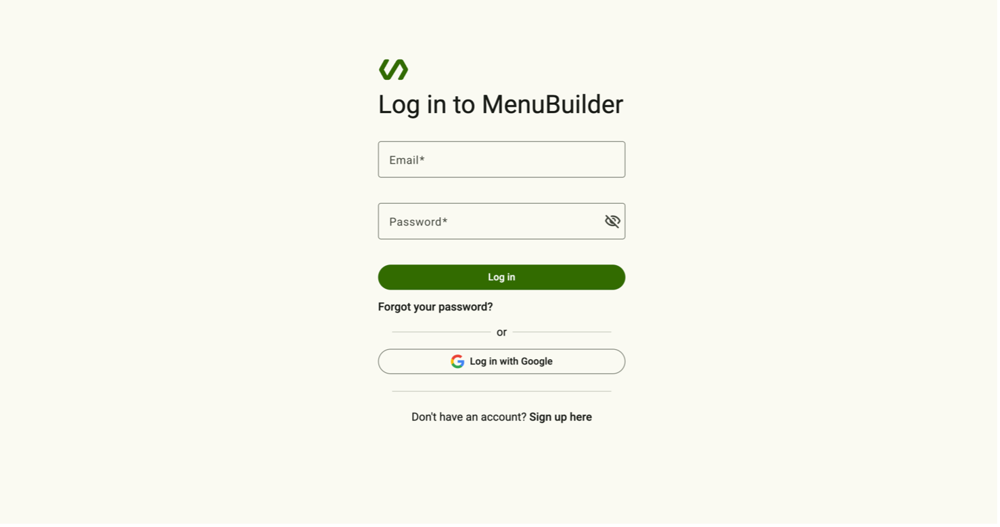
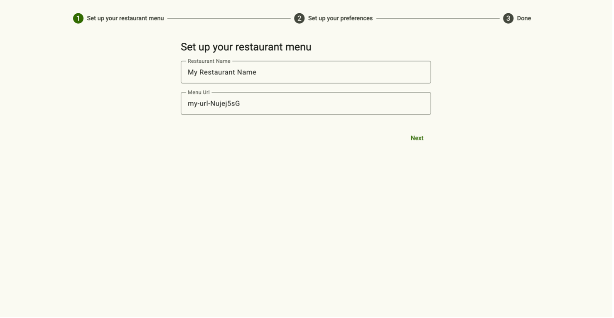
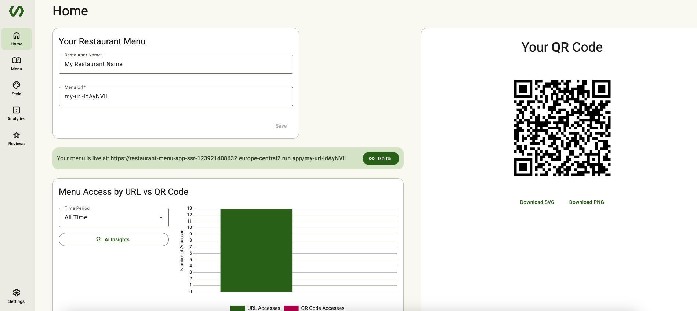
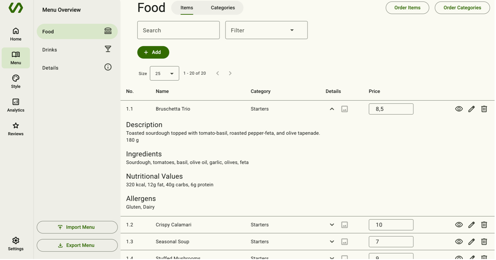
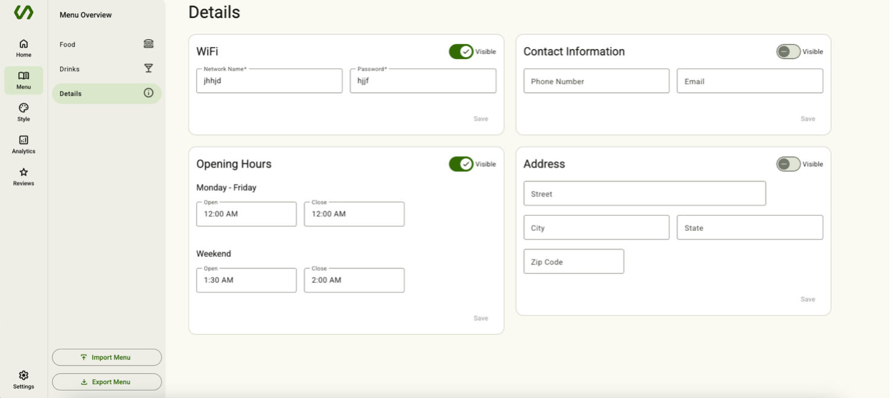
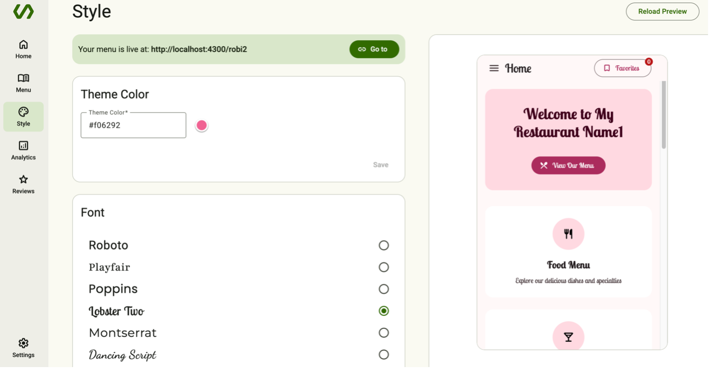
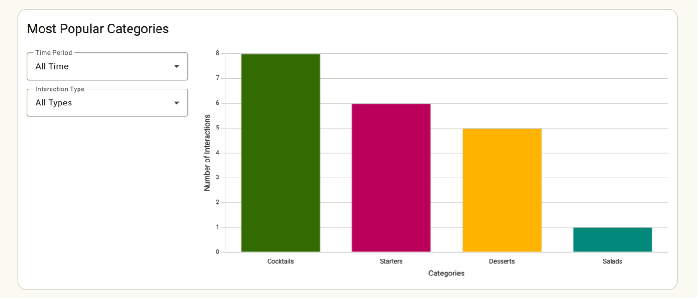
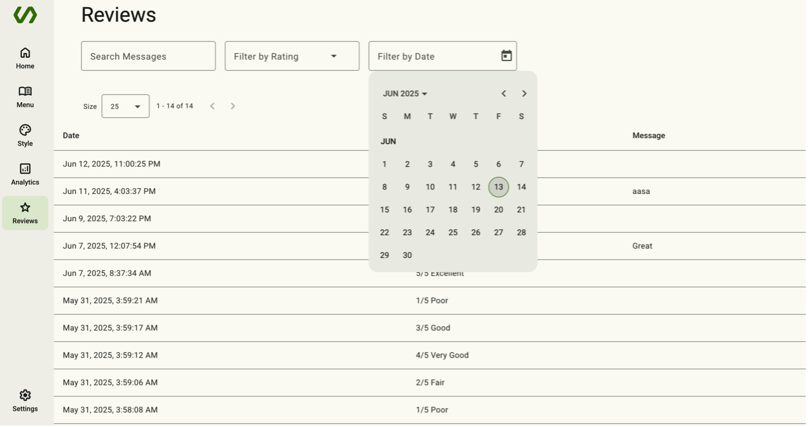
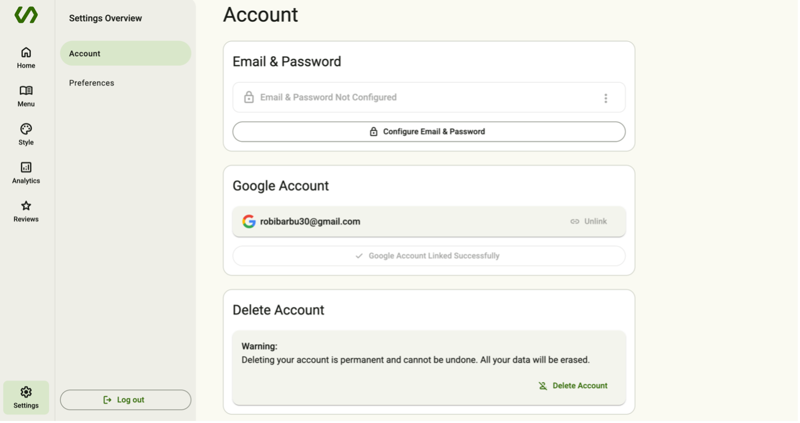

<strong>Menu Application (SSR)</strong>

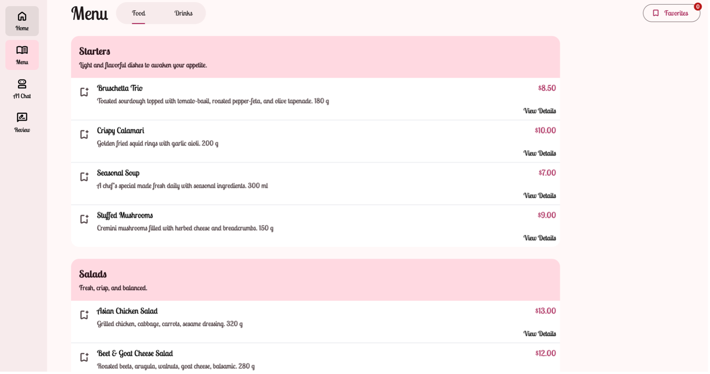
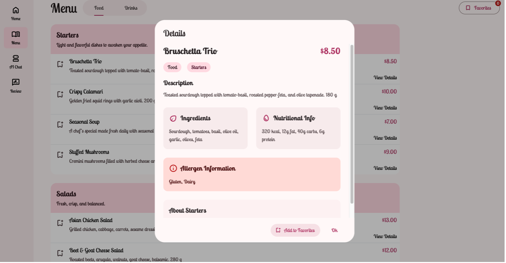
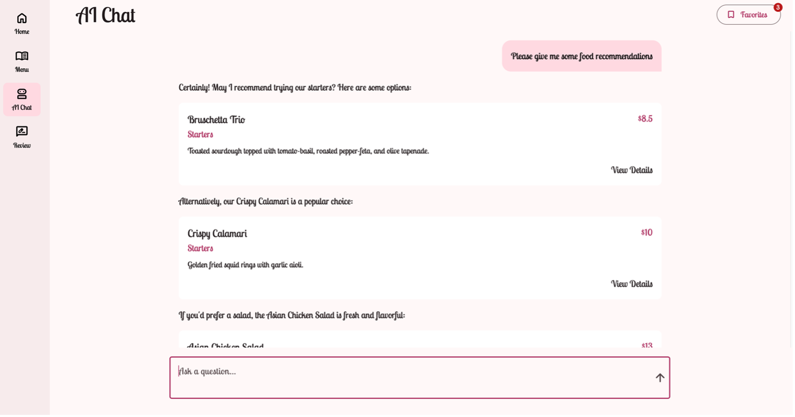

